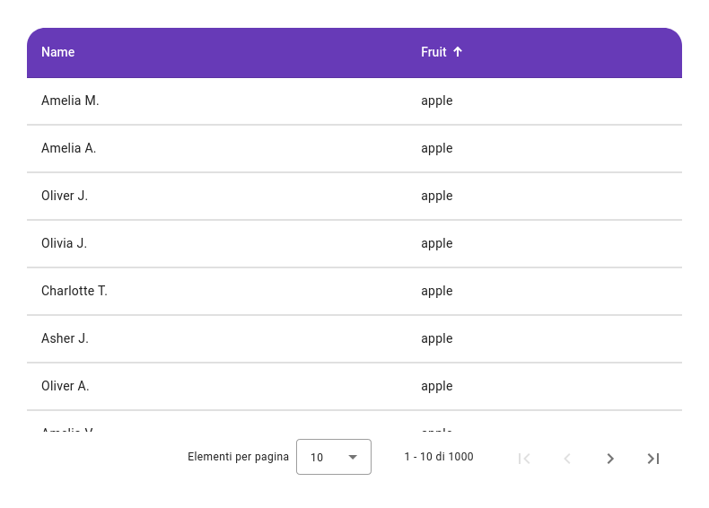

# IbTable

The `ib-kai-table`, built upon `mat-table` of Angular Material, provides high customization capabilities and out-of-the-box compatibility with other components such as `ib-filter` for filtering, `ib-table-view-group` to manage user-defined views, and much more.

- [IbTable](#ibtable)
  - [Getting started](#getting-started)
  - [Columns](#columns)
    - [Text column](#text-column)
    - [Number column](#number-column)
    - [Date column](#date-column)
    - [Custom column](#custom-column)
    - [Action column](#action-column)
  - [Use server-side data as a source](#use-server-side-data-as-a-source)

<!-- TOC ignore:true -->

## Getting started

First, add the `ib-kai-table` component to your template and pass in data.

You can provide data to the table using a `MatTableDataSource` instance. An `IbDataSource` is also available for [server-side interactions.](#use-server-side-data-as-a-source)

```html
<ib-kai-table [dataSource]="dataSource"> ... </ib-kai-table>
```

```typescript
@Component({
  /* ... */
})
export class SimpleKaiTableExample {
  dataSource = new MatTableDataSource<any>(TABLE_DATA);
}
```

Next, write your table's column templates.

Each column definition should be given a name. By default, the name of the columns will be the header text and data property accessor.

Take the following column as an example.

```html
<ib-text-column name="fruit"></ib-text-column>
```

This `ib-text-column` component will assume that the type of data to display is a string. The `name` input will be used as a data accessor, the cells will render the value found in the data's property matching the column's name. In this case, if the column is named `fruit`, then the rendered value will be the value defined by the data's `fruit` property.

Finally, tell the table which columns to be rendered.

Putting it all together, you'll have:

```typescript
const EXAMPLE_DATA = [
  {
    name: "Amelia M.",
    fruit: "apple",
  },
  // ...
];

@Component({
  /* ... */
})
export class SimpleKaiTableExample {
  dataSource = new MatTableDataSource<any>(TABLE_DATA);
  displayedColumns = ["name", "fruit"];
}
```

```html
<ib-kai-table [dataSource]="dataSource" [displayedColumns]="displayedColumns">
  <ib-text-column name="name"></ib-text-column>
  <ib-text-column name="fruit"></ib-text-column>
</ib-kai-table>
```



## Columns

There are more column types available other than `ib-text-column`.

### Text column

```html
<ib-text-column name="fruit" justify="start"></ib-text-column>
```

### Number column

```html
<ib-number-column name="price" digitsInfo="1.0-2"></ib-number-column>
```

### Date column

```html
<ib-date-column name="created_at" format="dd/MM/yyyy"></ib-date-column>
```

### Custom column

```html
<ib-column name="subscribed">
  <section *ibCellDef="let element">
    <mat-icon [color]="element.subscribed ? 'accent' : ''">{{ element.subscribed ? "done" : "close" }}</mat-icon>
  </section>
</ib-column>
```

### Action column

```typescript
@Component({
  /* ... */
})
export class KaiTableRowActionExample {
  dataSource = new MatTableDataSource<any>(TABLE_DATA);
}
```

```html
<ib-kai-table [displayedColumns]="['name', 'fruit', 'stock']" [dataSource]="dataSource">
  <!-- ... -->
  <ib-column ib-action-column>
    <section *ibCellDef="let element">
      <button mat-icon-button (click)="handleShowReport(element)">
        <mat-icon>chevron_right</mat-icon>
      </button>
      <button mat-icon-button [matMenuTriggerFor]="menu">
        <mat-icon>more_vert</mat-icon>
      </button>
      <mat-menu #menu="matMenu">
        <button mat-menu-item (click)="handleDelete(element)">delete</button>
      </mat-menu>
    </section>
  </ib-column>
</ib-kai-table>
```

```typescript
handleShowReport(data: Record<string, any>) {
  // your code here
}

handleDelete(data: Record<string, any>) {
  // your code here
}
```

## Use server-side data as a source

(docs no ready)
